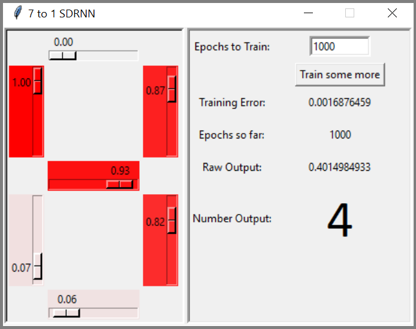
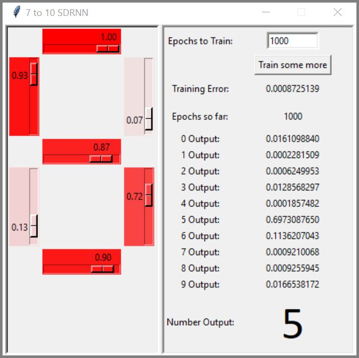
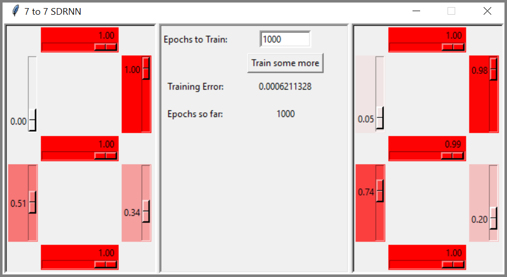

# Feedforward Neural Networks in Python

This project is a Python class for a ***MultiLayer Perceptron*** with the sigmoid activation function, that learns using the Backpropagation algorithm. This is the application showcased in my online courses about Training Neural Networks in Python. 

The application is a Segment Display Recognition Neural Network, or SDRNN for short. It's a system that takes in a vector of 7 real numbers from 0.0 to 1.0, which represent the intensity of the LED segments in a 7-segment LED display, as if a computer vision system were required to recognize the digit being displayed. 

There are 3 implementations of the SDRNN, each contained in its own source file.

### Run the SDRNN in your own Python setting

You'll need Python 3 and numpy. Simply run the command `python SDRNX_7toX.py` where X is 1, 7, or 10.

### Run it online! ###

You may also run the SDRNN and play with the code at Repl.it: https://repl.it/@kuashio/segment-display-neural-network 

## Source Files

- **MLP.py** - The MultiLayer Perceptron class. It has no GUI, but it shows some testing examples if you run it. These examples are simple 2-input gates: AND, OR, XOR, and so on, all hardcoded into the MLP. Finally, the MLP is trained to learn the XOR behavior with the backpropagation algorithm. 

- **SDRNN_7to1.py** - The 7 input, 1 output model of the neural network to produce a scalar that shows the recognized number. This is considered bad practice, as it's pushing a regression tool to solve a classification problem.

  

- **SDRNN_7to10.py** - The 7 input, 10 output model of the neural network to produce a One-Hot encoded vector of 10 outputs, where the one with the greatest value represents the recognized number. 

  

- **SDRNN_7to7.py** - The 7 input, 7 output model of the neural network to produce another 7 segment display showing the number inferred by the neural network. This may seem silly at first, but it shows the neural network's capability of generalizing. In other words, it shows how the neural network reacts to patterns it hasn't seen before (e.g. invalid 7 segment patterns.)

  

## Contact

Eduardo Corpeño

kuashio@gmail.com

Enjoy!
